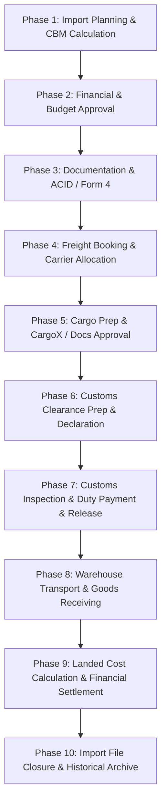

# ImportFlow ERP - System Documentation & Architecture Guide

## 📋 Overview
**ImportFlow ERP** هو نظام إدارة متكامل لمراحل ومستندات وعمليات الاستيراد والتخليص الجمركي والخدمات اللوجستية (ERP for Import, Customs, and Logistics Management).
تم تصميم النظام وفقًا لأحدث مبادئ إدارة البيانات المرجعية (**Master Data Management**) وإدارة مراحل العمل المرنة (**Flexible Workflow**) لمواكبة متطلبات التجارة الدولية والتنظيمات الجمركية.

---

## 🏗️ System Architecture & Core Principles (فلسفة ومبادئ النظام)

### 1. Business Vision & Master Data Integrity
- **توحيد البيانات المرجعية**: يتم إدخال بيانات الـ Master Data مرة واحدة فقط وإعادة استخدامها في كل مراحل دورة العمل لمنع تكرار البيانات وتقليل الأخطاء الإدخالية.
- **التصميم المعتمد على الإعدادات (Configuration Over Customization)**: التحكم في مراحل وسلوك النظام وإلزامية الحقول عبر الإعدادات بدون تغيير الكود.

### 2. Flexible Workflow & Operational State Management
- **محطات تشغيلية (Operational Milestones)**: لا يشترط المرور بجميع مراحل التشغيل بنفس الترتيب، وتختلف دورة العمل حسب نوع الشحنة، متطلبات المورد، تعليمات البنك، واشتراطات الجمارك.
- **إدارة الحالة التشغيلية (Current Operational State)**: كل شحنة تمتلك حالة تشغيلية واحدة واضحة تعكس موضعها الحالي في سير العمل.

---

## 📂 System Documentation & Phase Directories (مجلدات المراحل والمهام)

تم تقسيم التوثيق والمهام التفصيلية لكل مرحلة داخل المجلد [`docs/`](file:///c:/Users/Hp/Desktop/ImportFlow/docs) إلى مجلدات مخصصة تحتوي على دليل المرحلة وقائمة المهام (**Tasks**):

| Phase Folder | Phase Name | BP Tasks Included | Tasks Folder Link |
| :--- | :--- | :--- | :--- |
| 🗂️ [`docs/01_master_data.md`](file:///c:/Users/Hp/Desktop/ImportFlow/docs/01_master_data.md) | **Master Data & Principles** | General Principles (GP-001 to GP-004), Master Data Specs (MD-001 to MD-026) | - |
| 🚀 [`docs/phase_01/`](file:///c:/Users/Hp/Desktop/ImportFlow/docs/phase_01) | **Phase 1: Planning & Feasibility** | BP-001 to BP-011 | [`docs/phase_01/tasks/`](file:///c:/Users/Hp/Desktop/ImportFlow/docs/phase_01/tasks) |
| 💰 [`docs/phase_02/`](file:///c:/Users/Hp/Desktop/ImportFlow/docs/phase_02) | **Phase 2: Financial Approval** | BP-012, BP-013 | [`docs/phase_02/tasks/`](file:///c:/Users/Hp/Desktop/ImportFlow/docs/phase_02/tasks) |
| 📜 [`docs/phase_03/`](file:///c:/Users/Hp/Desktop/ImportFlow/docs/phase_03) | **Phase 3: Import Documentation** | BP-014 to BP-016 | [`docs/phase_03/tasks/`](file:///c:/Users/Hp/Desktop/ImportFlow/docs/phase_03/tasks) |
| 🚢 [`docs/phase_04/`](file:///c:/Users/Hp/Desktop/ImportFlow/docs/phase_04) | **Phase 4: Freight Booking** | BP-017 to BP-019 | [`docs/phase_04/tasks/`](file:///c:/Users/Hp/Desktop/ImportFlow/docs/phase_04/tasks) |
| 📦 [`docs/phase_05/`](file:///c:/Users/Hp/Desktop/ImportFlow/docs/phase_05) | **Phase 5: Cargo Prep & CargoX** | BP-020 to BP-025 | [`docs/phase_05/tasks/`](file:///c:/Users/Hp/Desktop/ImportFlow/docs/phase_05/tasks) |
| 📋 [`docs/phase_06/`](file:///c:/Users/Hp/Desktop/ImportFlow/docs/phase_06) | **Phase 6: Customs Clearance Prep** | BP-026 to BP-028 | [`docs/phase_06/tasks/`](file:///c:/Users/Hp/Desktop/ImportFlow/docs/phase_06/tasks) |
| 🛃 [`docs/phase_07/`](file:///c:/Users/Hp/Desktop/ImportFlow/docs/phase_07) | **Phase 7: Customs Clearance & Release** | BP-029 to BP-032 | [`docs/phase_07/tasks/`](file:///c:/Users/Hp/Desktop/ImportFlow/docs/phase_07/tasks) |
| 🏢 [`docs/phase_08/`](file:///c:/Users/Hp/Desktop/ImportFlow/docs/phase_08) | **Phase 8: Warehouse Receiving** | BP-033 to BP-035 | [`docs/phase_08/tasks/`](file:///c:/Users/Hp/Desktop/ImportFlow/docs/phase_08/tasks) |
| 📊 [`docs/phase_09/`](file:///c:/Users/Hp/Desktop/ImportFlow/docs/phase_09) | **Phase 9: Financial Settlement & Landed Cost** | BP-036 to BP-039 | [`docs/phase_09/tasks/`](file:///c:/Users/Hp/Desktop/ImportFlow/docs/phase_09/tasks) |
| 🔒 [`docs/phase_10/`](file:///c:/Users/Hp/Desktop/ImportFlow/docs/phase_10) | **Phase 10: Import File Closure** | BP-040 | [`docs/phase_10/tasks/`](file:///c:/Users/Hp/Desktop/ImportFlow/docs/phase_10/tasks) |

---

## 🗺️ Business Process Flow Diagram (خط سير الشحنة)

---
*تم إنشاء وتنظيم الهيكل استنادًا إلى المواصفات التفصيلية للعمليات في `doc.md`.*
