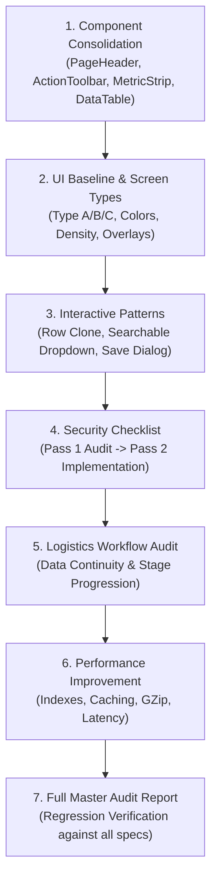

# 📚 Design System & Engineering Specifications — Master Index (INDEX.md)

> **Antigravity Instruction:** This is the primary index and single source of truth for all design system standards, interaction patterns, security rules, and performance guidelines in **ImportFlow ERP**. 
> Always inspect this index first in any session before modifying screens or core components.

---

## 🏛️ Master Specification Registry

| Spec Filename | Purpose / Scope | Target Area | Status | Priority Order |
|:---|:---|:---|:---:|:---:|
| [`component-consolidation-and-density-wiring.md`](component-consolidation-and-density-wiring.md) | Single shared implementations of PageHeader, ActionToolbar, MetricCardStrip, and DataTable across all screens | Shared Components (`core/widgets/`) | **Active** | **Step 1** |
| [`baseline-stage-screen.md`](baseline-stage-screen.md) | Type A Stage/Review Screen architecture, stage badge, action header, lifecycle buttons | Type A Screens | **Active** | **Step 2.1** |
| [`screen-types-addition.md`](screen-types-addition.md) | Type A vs Type B vs Type C screen classification, rules, and mandatory Button Color Palette Matrix | UI Architecture & Buttons | **Active** | **Step 2.2** |
| [`compact-toolbar-and-overlap-fix.md`](compact-toolbar-and-overlap-fix.md) | Single-row compact toolbar (max 40px), inline search & filter, popover anti-collision & flip rules | Toolbars & Menus | **Active** | **Step 2.3** |
| [`compact-metric-strip.md`](compact-metric-strip.md) | Single-row metric strip, `[icon] Title: Value`, density heights (42/34/28px), short labels | Metric Cards | **Active** | **Step 2.4** |
| [`typography-density-scale.md`](typography-density-scale.md) | Global density scale (Comfortable, Compact, Ultra-Compact) font scale, padding scale, central control | Typography & Density | **Active** | **Step 2.5** |
| [`metric-label-and-overlap-extension.md`](metric-label-and-overlap-extension.md) | Metric short label enforcement, truncation prevention, desktop side-docking (>=1200px), bubble collapse | Overlays & Metrics | **Active** | **Step 2.6** |
| [`row-clone-spec.md`](row-clone-spec.md) | Standardized shipment / row cloning pattern, field duplication, new code generation dialog | Data Duplication | **Active** | **Step 3.1** |
| [`searchable-dropdown-spec.md`](searchable-dropdown-spec.md) | Mandatory `SearchableDropdownField<T>` with live search bar for all foreign keys & references | Input Forms | **Active** | **Step 3.2** |
| [`export-save-dialog-fix.md`](export-save-dialog-fix.md) | Native modal "Save As" file location picker, AbortError graceful handling, FileSaveHelper, notification toast | Export & Downloads | **Active** | **Step 3.3** |
| [`pre-launch-security-checklist.md`](pre-launch-security-checklist.md) | 12-point security lockdown: secrets in git, HTTPS/HSTS, dependency CVEs, SQL injection, RBAC, rate limiting, CORS | Security & Hardening | **Active** | **Step 4** |
| [`logistics-workflow-architecture-audit.md`](logistics-workflow-architecture-audit.md) | 10-stage lifecycle board, 46 operational checklist tasks, two-way ImportFile synchronization, smart tasks | Logistics Engine | **Active** | **Step 5** |
| [`performance-improvement-phase.md`](performance-improvement-phase.md) | Steps 0 to 5: Baseline benchmarks, DB B-tree indexes, in-memory caching, GZip compression, auth caching | Backend & Network | **Active** | **Step 6** |

---

## 🚦 Recommended Execution Order

---

## 📜 Session Operating Instructions
1. In every Antigravity interaction, consult this `INDEX.md` file.
2. Open and apply only the relevant spec for the immediate task.
3. Every session must append an entry to [`execution-log.md`](execution-log.md).
4. Do not commit directly to production branches without diff confirmation.
5. If two specifications conflict, **stop and ask the user** (never guess).
