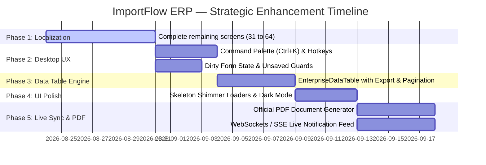

# 🏛️ ImportFlow ERP — Enterprise Code & Frontend Excellence Roadmap

> **الهدف الاستراتيجي:** الارتقاء بنظام **ImportFlow ERP** من مستوى التطبيق الوظيفي المستقر إلى **منظومة برمجية مؤسسية من الفئة الأولى (Enterprise Tier-1 Suite)** تضاهي كبرى الأنظمة العالمية (SAP, Odoo, NetSuite) من حيث المعمارية، وتجربة المستخدم المكتبية، وسرعة الاستجابة، وجودة الكود.

---

## 1. 🖥️ الركيزة الأولى: تجربة الاستخدام المكتبي المتقدمة (Desktop-First UX & Power-User Suite)

### أ. لوحة الأوامر السريعة (Command Palette / Spotlight Search) `Ctrl + K`
- **المفهوم:** نافذة بحث ذكية وعائمة تظهر بضغطة زر وتتيح:
  - البحث الفوري والتنقل لأي شحنة (`IMP-2026-XXXX`)، أمر شراء (`PO-XXXX`)، أو بند تعريفة (`HS Code`).
  - فتح الشاشات والوظائف مباشرة (مثل "فتح حاسبة CBM"، "إصدار شهادة إغلاق"، "تصدير قيود Odoo").
  - تنفيذ إجراءات سريعة دون الحاجة للوصول إلى القوائم الجانبية.

### ب. اختصارات لوحة المفاتيح العالمية (Global Hotkeys Engine)
- `Ctrl + S`: حفظ فوري للنموذج النشط.
- `Ctrl + N`: فتح نافذة إضافة سجل جديد للشاشة الحالية.
- `Ctrl + F`: تركيز البحث في الجدول الحالي.
- `Esc`: إغلاق النوافذ المنبثقة والرجوع للخلف.
- دعم التنقل الكامل بـ `Tab` و `Enter` بين حقول الإدخال.

### ج. حماية التعديلات غير المحفوظة (Dirty Form State & Navigation Guards)
- تتبع حالة النماذج والمدخلات ومقارنتها بالبيانات الأصلية.
- تنبيه المستخدم بنافذة تأكيد عند محاولة إغلاق النافذة أو التنقل لشاشة أخرى في حال وجود تعديلات لم تُحفظ بعد.

### د. دعم الوضع الليلي (Dark Theme) والتباين العالي
- إضافة ثيم داكن احترافي متكامل `AppTheme.darkTheme` يعتمد على درجات الرمادي الفاحم والأزرق الهادئ لتقليل إجهاد العين أثناء جلسات العمل والتدقيق الطويلة.

---

## 2. 📊 الركيزة الثانية: محرك الجداول الموحد والبيانات الضخمة (Unified Enterprise Data Table)

استبدال الجداول الفردية بمكون موحد عالي الأداء (`EnterpriseDataTable<T>`):

### الخصائص الأساسية:
1. **Server-Side Pagination & Virtualization:**
   - جلب البيانات على دفعات (`limit`, `offset`) مع دعم التمرير الافتراضي السلس للتعامل مع آلاف الشحنات.
2. **Column Resizing, Reordering & Visibility:**
   - إمكانية سحب وتوسيع الأعمدة وترتيبها وإخفائها وحفظ التفضيلات محلياً لكل مستخدم (`SharedPreferences`).
3. **Multi-Column Sorting & Filtering:**
   - فرز متعدد وفلترة لحظية داخل كل عمود.
4. **تصدير موحد بنقرة واحدة:**
   - تصدير فوري إلى Excel (`.xlsx`)، CSV، و PDF بتنسيق رسمي يحمل شعار المؤسسة.

---

## 3. 🎨 الركيزة الثالثة: التغذية البصرية والتحميل التفاعلي (Skeleton Shimmer & Micro-Interactions)

### أ. محاكاة الهيكل العظمي (Skeleton Shimmer Loaders)
- استبدال دوائر التحميل الدائرية `CircularProgressIndicator` بهياكل متحركة متدرجة تحاكي شكل البطاقات والجداول أثناء جلب البيانات لتعزيز الإحساس بسرعة النظام.

### ب. شارات التنبيه الحية (Live Pulse Badges)
- شارات بصرية نابضة للحالات الحرجة:
  - نبض أحمر لتنبيهات مهلة **ACID** (إذا تبقت ≤ 14 يوماً).
  - نبض برتقالي لعداد غرامات الأرضيات والحاويات **Demurrage & Detention**.

---

## 4. 🗂️ الركيزة الرابعة: تقسيم الشاشات للشاشات العريضة (Master-Detail Multi-Pane Layout)

- استغلال شاشات سطح المكتب الحديثة (1080p / 2K / 4K):
  - **اللوحة الجانبية (35%):** قائمة الشحنات، سجلات الفواتير، أو عروض الأسعار مع أدوات البحث والفرز.
  - **لوحة التفاصيل التفاعلية (65%):** عرض تفصيلي حي للوثائق المرتبطة، البوليصة، الإقرار الجمركي 46، والتسوية المالية مع إمكانية التعديل السريع دون فتح نوافذ منبثقة معقدة.

---

## 5. ⚡ الركيزة الخامسة: جودة الكود والمعمارية التحتية (Core Architecture & Connectivity)

### أ. التوجيه المتقدم والعميق (Declarative Routing with `go_router`)
- اعتماد نظام مسارات يعتمد على الروابط والـ Deep Links:
  - مسارات واضحة وقابلة للمشاركة والاحتفاظ بسجل التنقل (Back/Forward).
  - حفظ حالة التبويبات المفتوحة عبر جلسات العمل.

### ب. الاتصال المباشر والإشعارات الفورية (WebSockets / SSE)
- قناة اتصال دائمة بين خادم FastAPI وواجهة Flutter لتلقي التحديثات الفورية:
  - تحديثات حركة السفن والحاويات من شركات الملاحة.
  - إشعارات اعتماد المستندات من CargoX أو نافذة.
  - تحديث أسعار الصرف الرسمية للجمارك فور صدورها.

### ج. محرك المستندات والطباعة المتقدمة (Enterprise PDF & Barcode Generator)
- توليد مستندات وشهادات A4 رسمية عالية الدقة باستخدام `pdf` و `printing`:
  - تضمين شعار المؤسسة، الأختام الرقمية، الباركود، ورموز الاستجابة السريعة (QR Codes) لمطابقة المستندات والتحقق منها.

---

## 6. 🧪 الركيزة السادسة: الاختبارات التلقائية ومراقبة الأداء (Quality Assurance & Telemetry)

1. **Golden Tests (Pixel-Perfect UI Validation):**
   - اختبارات لقطات الشاشة الآلية للتحقق من ثبات التصميم في اللغتين العربية (RTL) والإنجليزية (LTR).
2. **Local Crash Reporting & Breadcrumbs:**
   - تسجيل الأخطاء والاستثناءات والعمليات غير المكتملة في ملفات سجل محلية مشفرة لتسهيل الدعم الفني.
3. **Repaint Boundaries & Performance Profiling:**
   - عزل الرسوميات والمخططات المعقدة (مثل محاكي رص الحاويات 3D Bin Packing) داخل `RepaintBoundary` لضمان سلاسة العرض عند 60/120 FPS.

---

## 🗺️ خطة العمل والجدول الزمني المقترح (Execution Roadmap)

